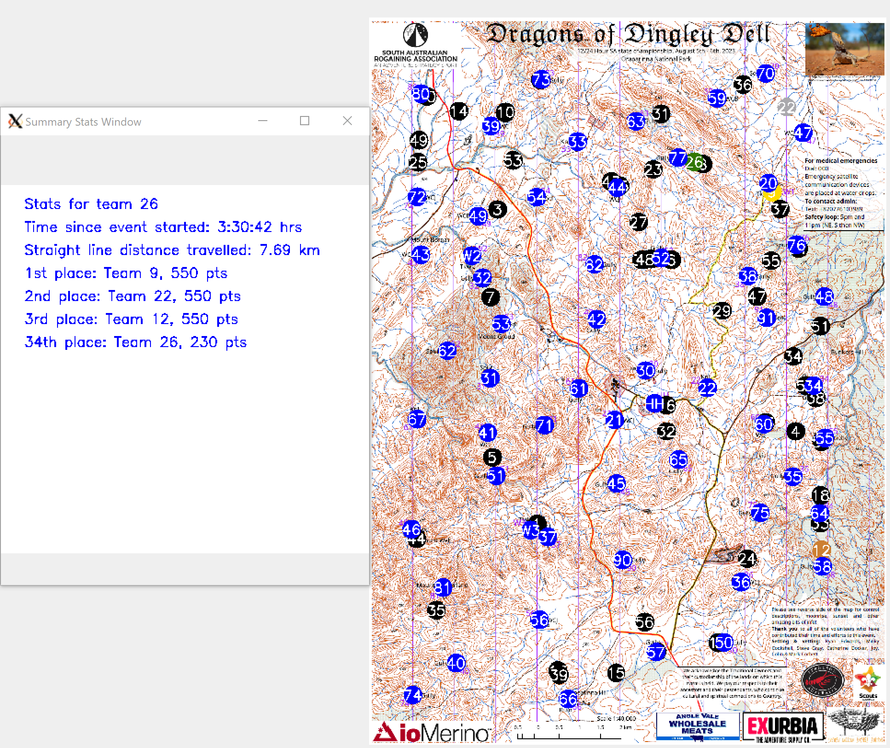

# rogaine-plotter

Rogaine Plotter is a tool to interpret the text based results from [Rogaining events](https://sarogaining.com.au/about-rogaining/) and replay them as a graphic.

# Usage
1. Clone this repo
2. Download the navlight results from an event. For example, for [this event](https://act.rogaine.asn.au/navlight/SARA/Dragons%20of%20Dingley%20Dell/html/), download all the **txt** files in `Overall Results`. I have used [Simple mass downloader](https://chrome.google.com/webstore/detail/abdkkegmcbiomijcbdaodaflgehfffed) to do this previously.
3. Copy the control statistics page (excl the title/subtitles) into a **txt** file
4. Copy the leg statistics page (excl the title/subtitles) into a **txt** file
5. Create a screenshot of the map and save as a **png**
6. `pip install -r requirements.txt`
7. `python3 main.py`
8. Follow the prompts

